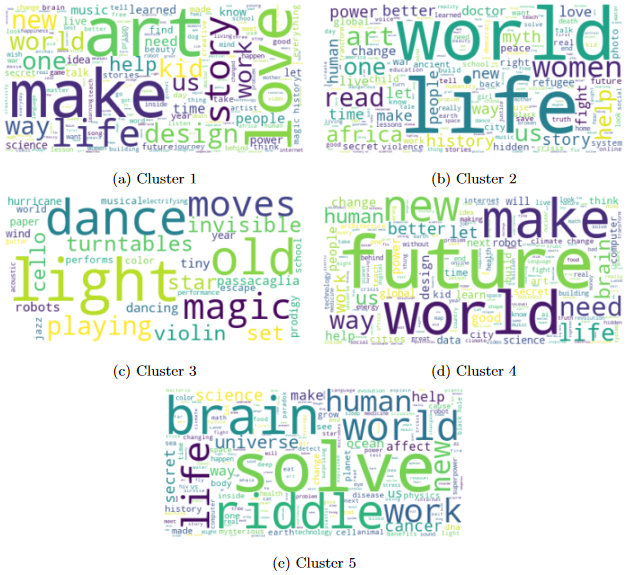
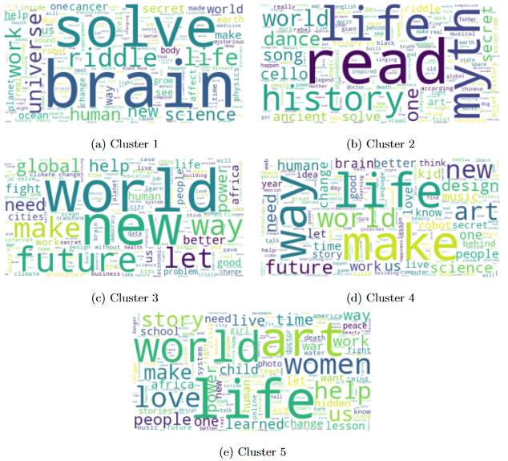

# Ted Talks Clustering 
Clustering over +4000 Ted Talks using the most common clustering algorithms and a comparaison between tf-idf and Word Embeddings.
Data from: https://www.kaggle.com/datasets/miguelcorraljr/ted-ultimate-dataset

* Comparison of clustering formed using tf-idf and word embeddings using the most commons clustering algorithms like KMeans, Gaussian Mixture Models and Agglomerative Clustering.
* Tuning of the hyperparameters of all models.
* Comparaison of the results using multiple clustering metrics (DBI, Silhoutte and Calinski).
* Bonus experiment using only the most relevant tf-idf words and partly solving the curse of dimensionality.
* Bonus experiment using word embeddings from Microsoft MiniLM-L12-H384.
* Final analysis using wordclouds and n-grams to identify the topics.
* Found insights about which algorithms and metrics work best for document clustering and why.
* I used cuML, Spark (PySpark) and sentence-transformers.

Wordclouds generated from KMeans with Bert Embeddings: 

Wordclouds generated from Gaussian Mixture Models with Bert Embeddings: 
